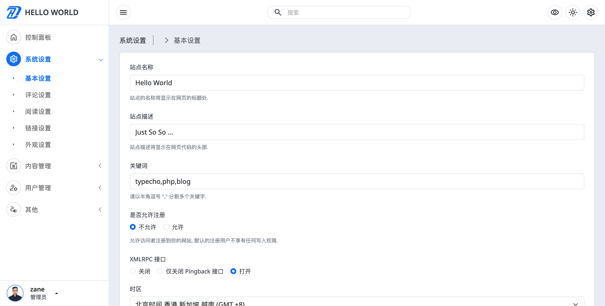
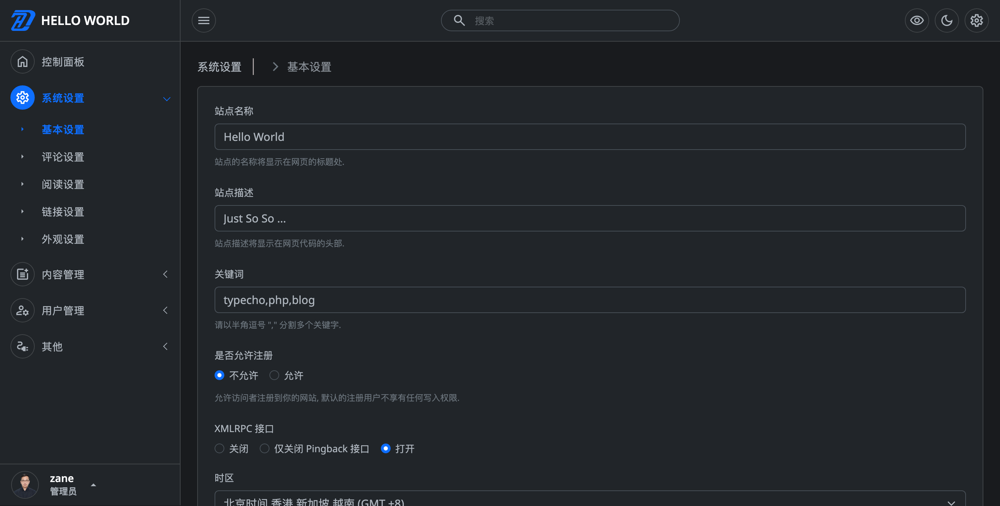
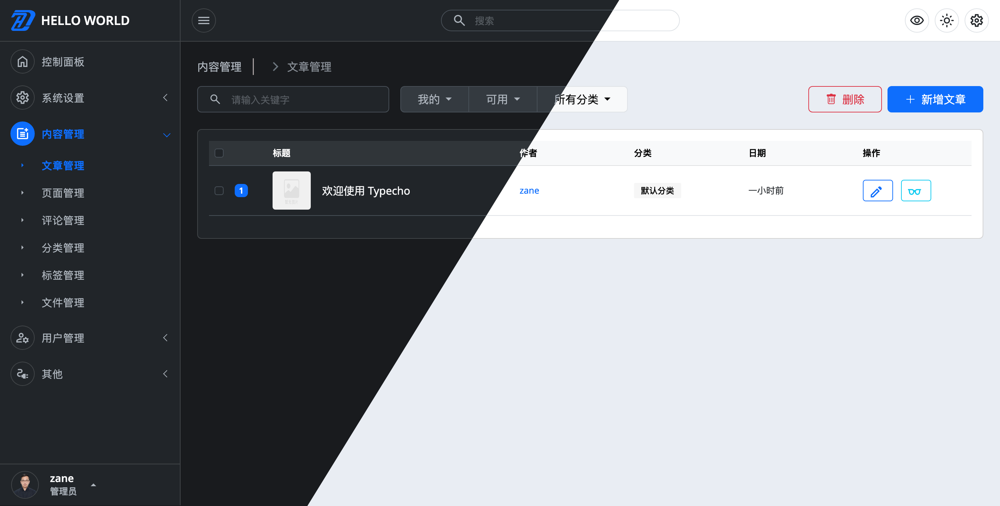
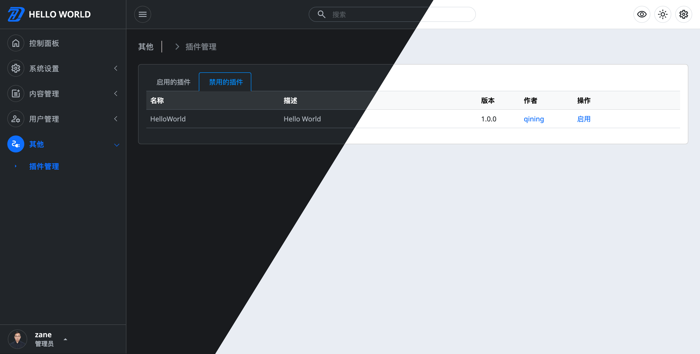
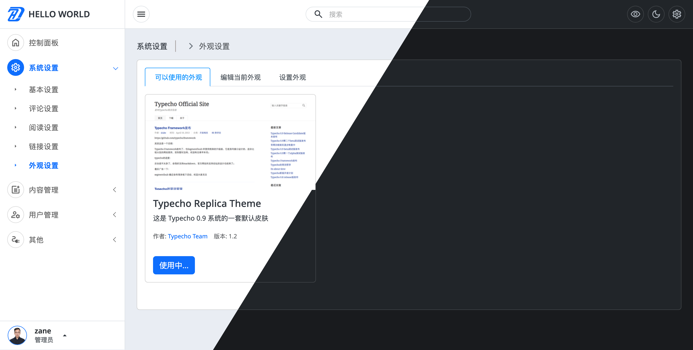

     

<h1>Typecho Admin DZH</h1>

## 简介
---
这是一套 Typecho 后台管理界面的项目，它使用 Bootstrap 5 框架构建。可以在所有主要的Web浏览器、桌面和所有智能手机设备上运行，提供浅色/深色两条主题，旨在提供更好的用户视觉体验。

## 安装使用
---
- docker 安装

- 替换文件部署
## 截图
---

    
     
     
    
     
     
    
     
     
    
     
     
    
     
     

